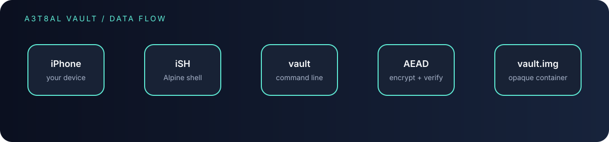
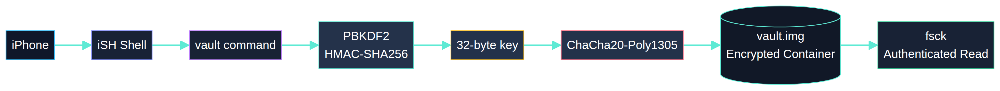
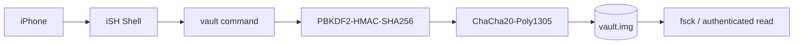

# A3t8al Vault

<p align="center">
  
</p>

<p align="center">
  <strong>Private files. One encrypted image. A clean iSH workflow.</strong>
</p>

<p align="center">
  <a href="https://github.com/A3t8al/a3t8al-vault/releases"></a>
  <a href="#ish-installation-on-iphone"></a>
  <a href="#security-model"></a>
</p>

<p align="center">
  
</p>

## Encrypted file container for iPhone, iSH, and Linux

A3t8al Vault is a command-line encrypted container. It stores file names, metadata, and file contents inside one authenticated file named `vault.img`. The image is designed to be unreadable without the vault password and to reject unauthorized modifications.

This distribution is intended for use inside **iSH on iPhone**. It includes a 32-bit Intel executable for iSH and a separate 64-bit Linux executable. The distribution contains executables and documentation only; development source files are not included.

> **Important:** This is a compact educational and personal-use utility. It has not undergone an independent security audit and must not be treated as a replacement for a professionally reviewed encrypted filesystem.

## Architecture at a glance



The operating path is deliberately short: iPhone, iSH, the `vault` command, authenticated encryption, and the protected `vault.img` container.

<details>
<summary><strong>Open the design overview</strong></summary>



</details>

---

## Contents

- [What the program does](#what-the-program-does)
- [How the vault works](#how-the-vault-works)
- [iSH installation on iPhone](#ish-installation-on-iphone)
- [First-time setup](#first-time-setup)
- [Daily commands](#daily-commands)
- [Interactive mode](#interactive-mode)
- [Backups and safe handling](#backups-and-safe-handling)
- [Integrity checking](#integrity-checking)
- [Security model](#security-model)
- [Limitations](#limitations)
- [Troubleshooting](#troubleshooting)
- [Release verification](#release-verification)

---

## What the program does

A3t8al Vault gives you a small encrypted storage container with these operations:

- Create a new encrypted image.
- Add a local file under an encrypted path.
- List stored paths and sizes.
- Extract a stored file back to the iSH filesystem.
- Remove a stored file.
- Verify the image and detect a wrong password or modified data.
- Open the container in a minimal interactive shell.

The original file names and contents are not stored as ordinary readable files inside `vault.img`. The vault image is the protected object that should be backed up and kept private.

---

## How the vault works

Each save creates a new random salt and nonce. The password is processed with PBKDF2-HMAC-SHA256 using 250,000 iterations. The resulting key is used with ChaCha20-Poly1305 authenticated encryption.

The image layout is:

```text
random salt | random nonce | authenticated ciphertext | Poly1305 tag
```

If the password is incorrect or any part of the image is modified, authentication fails and the program refuses to open it.

The `--size` argument is accepted as part of the command interface. This release grows the image as files are added; it does not preallocate a fixed-size filesystem.

---

## iSH installation on iPhone

### Requirements

- An iPhone with the iSH Shell application installed.
- Enough free storage for the executable and the encrypted image.
- The iSH Alpine environment with access to its package repositories.

### Step 1: Open iSH and update packages

Open iSH and run:

```sh
apk update
```

Install the OpenSSL runtime required by the iSH executable:

```sh
apk add libcrypto3
```

If your iSH repository uses a different package name, search for the package that provides `libcrypto.so.3`:

```sh
apk search openssl
```

### Step 2: Copy the iSH executable into iSH

Download the `vault-ish` asset from the private GitHub release on your iPhone. Use the iOS share sheet or the Files integration available in your iSH installation to copy the file into the directory where you want to use it.

For example, after the file is available in the current iSH directory:

```sh
mv vault-ish vault
chmod 700 vault
```

The executable is intentionally named `vault` in the commands below.

### Step 3: Run the self-test

```sh
./vault selftest
```

Expected output:

```text
crypto selftest: PASS (PBKDF2 + ChaCha20-Poly1305)
```

Do not continue if the self-test fails.

---

## First-time setup

Choose a long, unique password. Do not use a password that is used for another account or service.

Create a 64 MiB vault image:

```sh
./vault create --size 64M vault.img 'replace-this-with-a-strong-password'
```

The password is an argument in this release. Be aware that command arguments can be visible briefly to local process-inspection tools. Avoid using this utility on a compromised device.

Add a file to the encrypted container:

```sh
./vault put vault.img 'replace-this-with-a-strong-password' photo.jpg /documents/photo.jpg
```

List the encrypted entries:

```sh
./vault ls vault.img 'replace-this-with-a-strong-password'
```

Extract a file:

```sh
./vault get vault.img 'replace-this-with-a-strong-password' /documents/photo.jpg restored-photo.jpg
```

After extraction, `restored-photo.jpg` is an ordinary unencrypted file in iSH. Delete it when it is no longer needed.

---

## Daily commands

### Create

```sh
./vault create --size 64M vault.img 'PASSWORD'
```

### Store a file

```sh
./vault put vault.img 'PASSWORD' local-file.txt /notes/local-file.txt
```

Remote paths must begin with `/`.

### List entries

```sh
./vault ls vault.img 'PASSWORD'
```

### Extract a file

```sh
./vault get vault.img 'PASSWORD' /notes/local-file.txt local-file-restored.txt
```

### Remove an entry

```sh
./vault rm vault.img 'PASSWORD' /notes/local-file.txt
```

### Verify the image

```sh
./vault fsck vault.img 'PASSWORD'
```

### Run the interactive shell

```sh
./vault open vault.img 'PASSWORD'
```

---

## Interactive mode

The interactive mode is intentionally small:

```text
vault> ls
vault> rm /notes/local-file.txt
vault> quit
```

Supported commands are:

- `ls` — list entries.
- `rm PATH` — remove an entry and save the image.
- `quit` or `exit` — close the session.

For `put` and `get`, use the direct command-line forms described above.

---

## Backups and safe handling

The complete encrypted container is `vault.img`. Back up this file, not only the files extracted from it.

Recommended practice:

1. Close any command that is using the vault.
2. Copy `vault.img` to a second trusted storage location.
3. Protect the backup with the same care as the original.
4. Test a backup by copying it to a temporary name and running `fsck`.
5. Keep extracted files outside the vault only for as long as necessary.

A backup of `vault.img` is still protected by encryption, but a weak or reused password can make an offline password attack practical.

---

## Integrity checking

Run:

```sh
./vault fsck vault.img 'PASSWORD'
```

A healthy image reports the number of stored files. A wrong password or modified image is rejected with:

```text
tampering detected or wrong password
```

This check verifies authentication and format validity. It does not prove that an image is the newest backup and does not protect against rollback to an older valid image.

---

## Security model

### Protected against

- Reading the contents of `vault.img` without the password.
- Reading stored paths and file data directly from the image.
- Undetected modification of the authenticated image.
- Accidental exposure of plaintext database records in the image file.

### Not protected against

- A keylogger or malicious application on the iPhone.
- A compromised or jailbroken device.
- A stolen, weak, reused, or exposed password.
- Passwords visible in process arguments while a command is running.
- Memory inspection while the process is open.
- Rollback to an older valid copy of `vault.img`.
- File size, timing, or usage-pattern analysis.
- Plaintext files created by `get` outside the vault.

Use a trusted device, a strong unique password, and a secure backup policy.

---

## Limitations

This release rewrites the encrypted database when a change is made. It does not yet provide key slots, password rotation, keyfiles, snapshots, hidden volumes, encrypted size padding, Merkle indexing, a full write-ahead log, or secure password prompting.

The image is not a mountable filesystem and cannot be opened with the iOS Files application as a normal folder. Files are added and extracted through the `vault` command.

---

## Troubleshooting

### `not found` or `No such file or directory`

Confirm that the executable is in the current directory:

```sh
ls -l vault
```

Then set the executable bit:

```sh
chmod 700 vault
```

### Missing `libcrypto.so.3`

Install the OpenSSL runtime:

```sh
apk update
apk add libcrypto3
```

If the package is not found, search the configured iSH repositories:

```sh
apk search -v openssl
```

### `tampering detected or wrong password`

Check the password carefully, including capitalization and punctuation. If the password is correct, restore the last known-good backup and run `fsck` against the restored copy.

### The iSH process was closed

iSH may be suspended or terminated by iOS. Keep an independent backup of `vault.img` and run `fsck` after an interrupted operation.

---

## Release verification

The release includes `SHA256SUMS`. From a shell with SHA-256 tools available:

```sh
sha256sum -c SHA256SUMS
```

The `vault-ish` executable is a 32-bit Intel Linux binary intended for iSH. The `vault-linux-amd64` executable is for 64-bit Linux and is not the file to use inside iSH.

## License and use

Use this software at your own risk. Review the limitations before storing sensitive data. For high-value secrets, prefer a mature, independently reviewed tool such as age or an encrypted filesystem with a well-understood recovery model.
